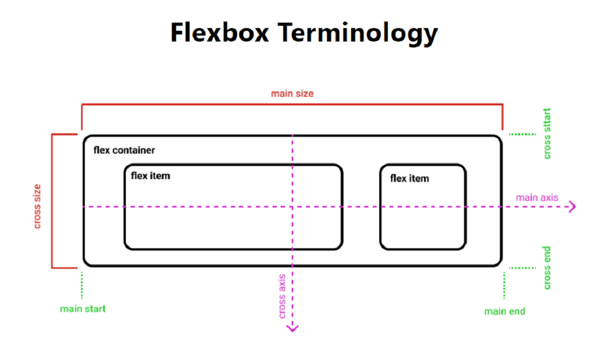
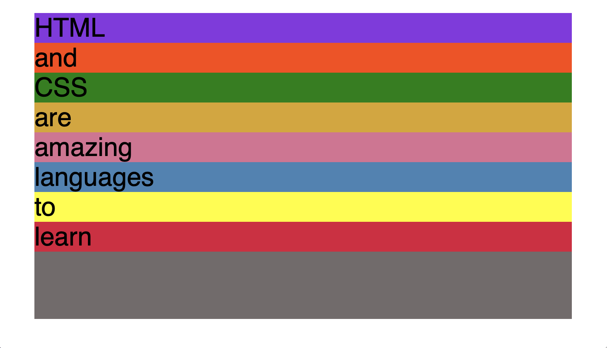
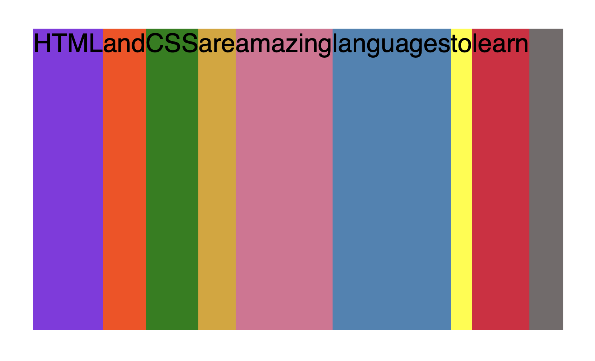
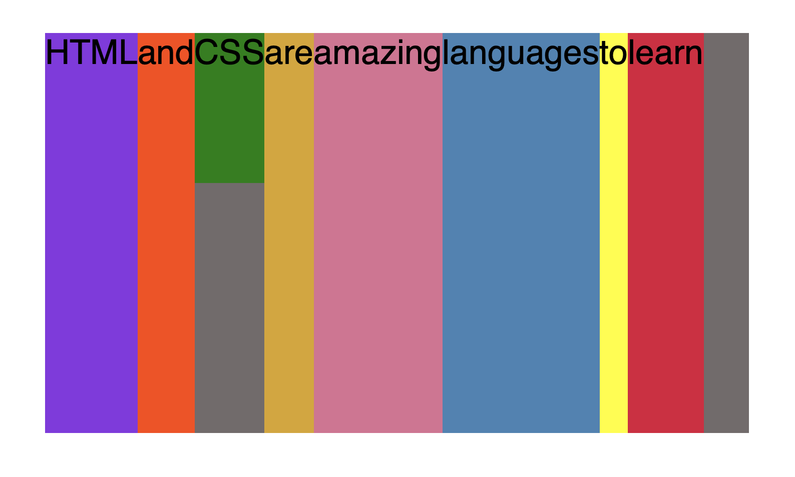
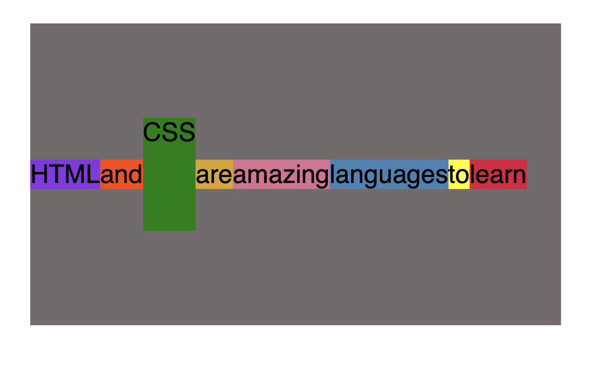
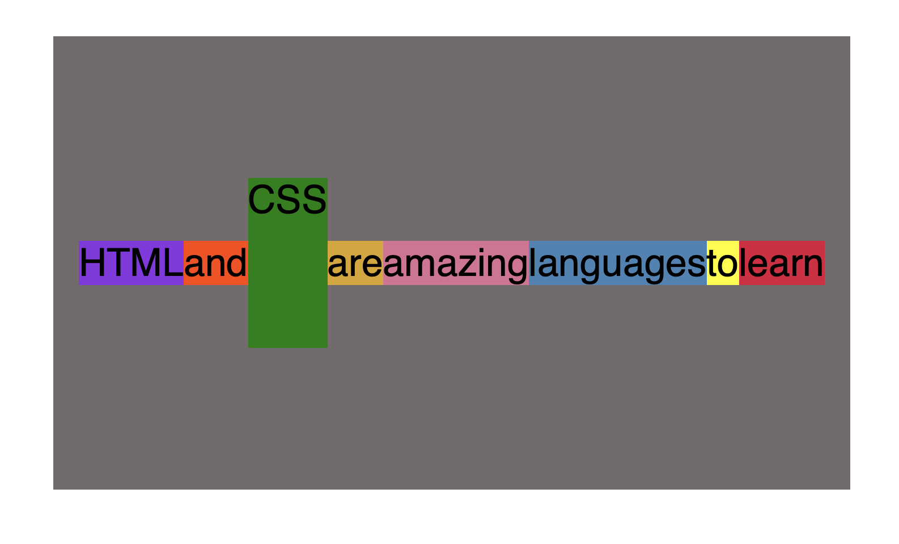

# 表格

Table:定义表格容器
tr :  table rows 定义行
th : table head 定义表头
td : table dock 定义单元格

table>tr>th|td

## table的属性


# 快捷键

```html
+ 标签并列关系 div+span
  <div></div>
	<span></span>

* 创建多个 div*3
  <div></div>
	<div></div>
	<div></div>

: 给input元素设置类型 input:password
 input:<input type="password" name="" />

{} 设置内容 lable{日期}
  <lable>日期</lable>

（）对内部的内容统一添加功能 （tr>td*2)*3
   <tr>
				<td></td>
				<td></td>
			</tr>
			<tr>
				<td></td>
				<td></td>
			</tr>
			<tr>
				<td></td>
				<td></td>
			</tr>

 [] 设置属性 div[id=demo class]
    <div id="demo" class=""></div>

$ 设置$符号起始数字 div{$}*5
  		<div>1</div>
			<div>2</div>
			<div>3</div>
			<div>4</div>
			<div>5</div>
	
div{$@5}*5 	 从5开始创建
    	<div>5</div>
			<div>6</div>
			<div>7</div>
			<div>8</div>
			<div>9</div>

【key=value】可以为属性复制
```


# CSS

## FlexBox




```html
<body>
    <div class="container">
      <div class="el el--1">HTML</div>
      <div class="el el--2">and</div>
      <div class="el el--3">CSS</div>
      <div class="el el--4">are</div>
      <div class="el el--5">amazing</div>
      <div class="el el--6">languages</div>
      <div class="el el--7">to</div>
      <div class="el el--8">learn</div>
    </div>
  </body>

```

```css
.container {
        height: 400px;
        font-family: sans-serif;
        background-color: #726b6b;
        font-size: 34px;
        margin: 40px;
    }
```

不使用flexbox，div block-element （背景色为灰色，注意背景不包含margin)




 **添加【display: flex】**

block元素变为水平

因为设置了container的高，所以所有元素的高都默认等于container的400

```css
   .container {
        /* STARTER */
        height: 400px;
        font-family: sans-serif;
        background-color: #726b6b;
        font-size: 34px;
        margin: 40px;
        display: flex;
      }
```



**css元素自己定义了高的时候**

```css
.el--3 {
        background-color: green;
        height: 150px;
   }
```



### align-items

垂直对齐方式

strench：默认值

align-items: center;

 flex-start =>all element move to the top




### justify-content

水平对齐方式

```css
.container {
        /* STARTER */
        height: 400px;
        font-family: sans-serif;
        background-color: #726b6b;
        font-size: 34px;
        margin: 40px;
        display: flex;
        align-items: center;
        justify-content: center;
      }
```


