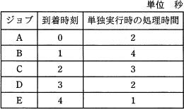
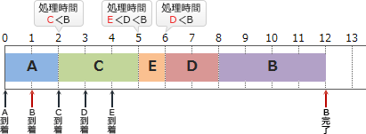
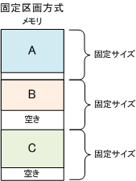
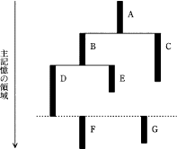
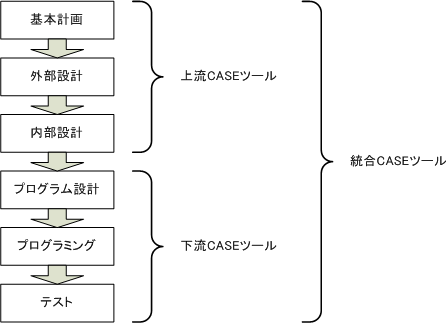

# ソフトウェア

## ジョブ、タスク管理

### ジョブ管理

#### スケジューリング

#### スプーリング

スプーリング（英: spooling、スプール）とは**稼動中の複数の周辺装置を同時並行に動作させること**。 転じて、（プリンタやメールサーバなどへの）出力データをバッファやストレージなどに一時的に保存しておくこと。（假脱机是一种数据缓冲，指传输数据的过程中，将数据存放在临时工作区中。其它程序可以在之后的任意时间点对其访问）

==スループットの向上に役立ちます。==

### タスク管理

#### タスクのスケジューリング

##### 処理時間順方式

**処理時間順方式**は、処理時間の短いタスクを優先的に実行するスケジューリング方式です。新たなタスクが到着すると処理の待ち行列に加わり、CPUが空くと待ち行列の中から予想処理時間が最も短いタスクが選択され、実行状態に移されます。また、ジョブの多重度が1なので、CPUは同時に1つのジョブしか処理できません。

##### ラウンドロビン

実行可能状態となった順に従って、タスクに一定のCPU時間(タイムクウォンタム)ずつ与えていくタスクスケジューリング方式です。

循环制 ：按顺序给每个task一定的CPU执行时间

各タスクに，==均等にCPU時間を割り当て==て実行させる方式である。

#### マルチタスク

多任务处理：複数のタスクを同時並行、もしくは短時間で切り替えながら同時進行で行うこと

インプリエンプティブ方式

プリエンプティブ方式

## 記憶管理

### 実記憶管理

#### 区画方式

##### 固定区画方式

主記憶をあらかじめ一定の大きさの区画に分け、その領域にプログラムを読み込む方法を固定区画方式という。
プログラムを読み込んだ後に==区画上に残っている空き領域は使用されない==。

>使用されない空き領域が生じる一方、アドレス計算やサイズ計算などのオーバーヘッドが減り、読み書き速度は安定化する。

【 **単一区画方式** 】
メモリを1つの区画とし、この区画にプログラムを読み込む。メモリ上には、1つのプログラムしか存在しない。

【 **多重区画方式** 】
メモリを一定の大きさの区画に分割し、区画ごとにプログラムをロードする方法。
この方法では、区画よりも大きなサイズのプログラムを読み込んで実行することはできない。

##### 可変区画方式

プログラムの大きさに応じて、メモリ上の区画の大きさも変えることでメモリを有効に利用する方式。
大きなプログラムも実行することができる。

>固定長方式と比較してメモリの使用効率はよいが、アドレス計算やサイズ計算などのオーバーヘッドは増加する

>## 【 **フラグメンテーション** 】と【 コンパクション 】

可変区画方式では、プログラムの必要とするサイズがそれぞれ異なるため、さまざまなプログラムを実行や終了などを繰り返すことで、メモリ上の空き領域がさまざまな領域に分かれて存在し、合計の空きメモリとしては十分な大きさがあるにもかかわらず、プログラムをロードすることができなくなってしまうことがある。
この状態を**==断片化(フラグメンテーション)==**と呼ぶ。
フラグメンテーションが起こるとプログラムをロードできなくなるため、現在のメモリ上のプログラムを再配置して、メモリの空き領域を集めて、1つの大きな空き領域とする作業が必要になる。この配置しなおすことを**==コンパクション==**という。

#### スワッピング方法

スワッピング (swapping) は、夫婦など性的関係にある男女のカップル2組以上が、パートナーを交換しておこなう性行為。

- スワップアウト:優先度の低いプログラムを一時中断して磁気ディスクに退避する
- スワップイン：優先度高いプログラムを主記憶に配置する

#### オーバレイ方法

overlay 在一般计算机概念中，覆盖表示“把一块指令或数据换为另外一块”。覆盖是一种编程方法，**==使得程序大小比主存空间大的时候也可以运行==**。嵌入式系统由于没有虚拟内存机制，也会因为物理内存的限制而使用覆盖技术。

**オーバーレイ**は、主記憶に格納できない大きいプログラムをいくつかのブロック(セグメント)に分割し、その時の==処理に必要なブロックだけを主記憶にロード==して実行する方式です。

>## 【 メモリリック 】と【 ガーベジコレクション 】
>
>メモリリック:主記憶の利用可能な領域が減少してしまう現象です。
>
>MemoryLeakは、コンピュータの動作中に使用可能な主記憶容量が徐々に減少していく状態を表します。アプリケーションが「自身で獲得したメモリの解放忘れる」などのプログラム不備などが原因で発生します。leakは漏えい、漏れ出すなどの意味です。
>
>解消方法：ガーベジコレクション(garbage)

##### 問題１：

同じ領域にロードされるモジュール同士の参照はできない
在同一领域的模块互相之间不能参照，因为会被替换。所以这里面A->F,A->G可以互相参照，但A->B,F->G之类的不行。

### 仮想記憶管理

#### ページング方式

##### ページフォルトとスラッシング

page fault 页缺失 

物理メモリ上に存在しないメモリ・ページへの参照が起こったときに発生する割り込み

==スラッシング==：颠簸　thrashing　ページフォルトが多発すると、処理効率が急激に低下する現象

>主記憶に存在しないページをアクセル時
>
>ページフォールト→置換え対象ページの決定→ページイン→ページアウト

##### ページ置き換えアルゴリズム

FIFO（First In First Out）：先に入れたものから先に取り出す

LIFO（Last In First Out）：後に入れたものから先に取り出す

LRU（Least Recently Used）：最も長い間参照されていないものから順に取り出す

LFU（Least Frequently Used）：最も使用頻度が低いものから順に取り出す（もっとも参照回数が少ない）

## 開発ツール

### CASEツール

电脑辅助软件工程 (Computer Aided Software Engineering)

##### テストツール

###### 静的テストツール

プログラムを実行しない状態でプログラムの検証を行うためのツールで、構文チェッカ，コードオーディタ(code auditor)，モジュールインターフェイスチェックツールなどがあります。

###### 動的テストツール

インスペクター，トレーサー，スナップショット，メモリダンプ，カバレージモニター，アサーションチェッカなどのプログラムを実行しながら検証を行うためのツール。

|                      | 英語        | 中国語 | 説明                                                         |
| :------------------- | :---------- | ------ | ------------------------------------------------------------ |
| インスペクター       | Inspector   |        | 何らかの対象の内部状態などを調べる働きをするソフトウェア eg:デバッグ時にデータ構造の内容を確認するためのツールをインスペクター |
| トレーサー           | Tracer      |        | **追跡プログラム ** <u>プログラムの実行過程を時系列</u>的にモニタリングするために，メモリやレジスタの内容を書き出す。 プログラムの命令の実行順序，実行結果などの履歴情報を出力する。 |
| スナップショット     | Snapshot    |        | 動的ダンプ  <u>プログラム中に埋め込んだデバッグ用のコード</u>を実行するたびに，メモリやレジスタの内容を書き出す。 |
| メモリダンプ         | memory dump |        | 核心文件，也称磁芯倾印，是**操作系统在进程收到某些信号而终止运行**时，将此时进程地址空间的内容以及有关进程状态的其他信息写入一个磁盘文件。这种信息往往用于调试。 静的ダンプ、<u>プログラムの異常終了時</u>に，メモリやレジスタの内容を書き出す。 |
| バレージモニター     |             |        | テストによって実行した経路から網羅度を算出する。             |
| アサーションチェッカ | assertion   |        | プログラムの正当性を検査するために、変数間で論理的に成立する条件が満たされているかをチェックするツールです |

###### 環境設定ツール

テストベッドツール，テストデータ生成ツールなどのテスト環境を準備するためのツール

#### **統合CASE**

システム開発における上流工程から下流工程まで全行程を支援する

### IDE

### コンパイルの流れ

最適化：レジスタの有効利用を目的としたレジスタ割付けや、不要な演算を省略するためのプログラム変換を行う

### 言語プロセッサ

言語プロセッサとは：プログラミング言語で作られたプログラムの翻訳作業を行うソフトウェアの総称です。

| 用語             | 英語              | 中国語         | 説明                                                         |
| :--------------- | :---------------- | -------------- | ------------------------------------------------------------ |
| インタプリタ     | interpreter       | 解释器         | 原始プログラムを，解釈しながら実行するプログラムである 「PHP」、「Python」といったスクリプト言語がほとんど  |
| *アセンブラ*     | assemble          | 汇编           | <u>アセンブラ語</u>のプログラムを機械語に翻訳するプログラム  |
| コンパイラ       | Compiler          |                | <u>汎用言語</u>で書かれたプログラムを機械語に翻訳するプログラム コンパイラを使ってソースコードを==機械語に変換==することを「コンパイル」といいます。  JITコンパイラ：JavaScript、Java  |
| *アセンブラ*     | assemble          | 汇编语言       | アセンブラ言語で記述されたソースコードを機械語に変換する言語プロセッサです |
| トランスレータ   | translator        | 翻译           | 原始プログラムを，推論しながら翻訳するプログラムである。 ある処理系用に書かれた原始プログラムを，ほかの処理系用の原始プログラムに変換する Typescriptで書かれた言語をJavascriptに変換する。 |
| クロスコンパイラ | cross compiler    | 交叉编译器     | コンパイルを実施するコンピュータとは==異なるアーキテクチャをもったコンピュータ==で動作するオブジェクトコードを生成する ex:Windowsでコンパイルして、電子レンジで動作するコードを生成 |
| シミュレーター   | simulator         | 模拟           | 実際に実験を行うのではなくコンピュータプログラム上で模擬試験をするためのツールです 災害時等の被害予想や仕事の訓練、現実的な物の再現 |
| エミュレータ     | Emulator          | 也有译作仿真器 | ==ほかのコンピュータ用==のプログラムを解読し，実行するマイクロプログラムである。 電子機械の機能や動作を模倣し、==仮想マシン==として実行できるシステムやソフトウェア |
| *アセンブラ*     | assemble          | 汇编           | アセンブラ言語で記述されたソースコードを機械語に変換する言語プロセッサです |
| DFD              | Data-flow diagram | 数据流图       |                                                              |
| ジェネレーター   |                   |                | ソースコードを記述しなくても処理条件の入力・処理・出力・引数などのパラメータを指定することで自動的にプログラムを生成する言語プロセッサです。 |
|                  |                   |                |                                                              |
|                  |                   |                |                                                              |

# 計算問題

### ターンアラウンドタイム

**ターンアラウンドタイム**は、入力の開始を始めたときからすべての出力を受け取るまでに要する時間のことをいいます。

https://www.fe-siken.com/bunya.php?m=5&s=1&no=3

### バーファサイズ

https://www.fe-siken.com/bunya.php?m=5&s=1&no=7

### CPUの遊休時間

注意：I/Oは競合かひ、CPUは何コア

# 用語一覧

- [ ] オーバーヘッド
- [ ] スプーリング
- [ ] メモリリック
- [ ] スラッシング

# UNIX

## シェル

### **リダイレクト**

出力先を切り替える「>」

出力先のファイルに追加する「>>」

入力元を切り替える「<」

複数行の入力を行える「<<」

