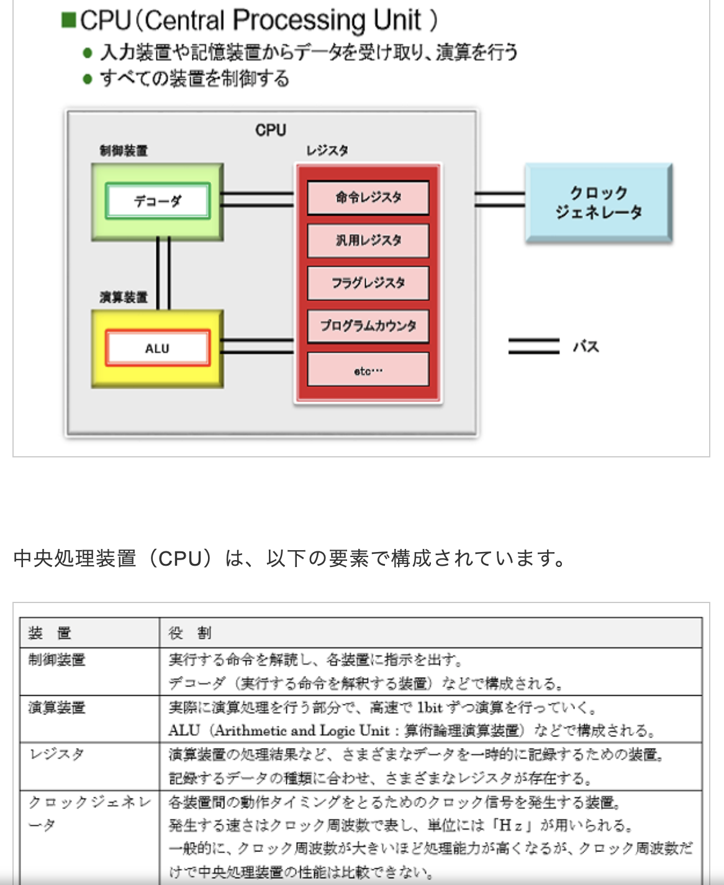

# 試験構成

|             試験名             | 試験時間 | 出題数/解答数 |         出題形式          |
| :----------------------------: | :------: | :-----------: | :-----------------------: |
| 基本情報技術者試験（午前試験） |  150分   |   80問/80問   |  多肢選択式 （四肢択一）  |
| 基本情報技術者試験（午後試験） |  150分   |   11問/5問    | 多肢選択式 （選択問題あり |

# １.午前試験の出題範囲

## 1-1 テクノロジ系 technology(50問)

午前試験は150分で終了します

## 1-2 マネジメント系 manegement

## 1-3 ストラテジ系 strategy

# ２.午後試験

午後試験は150分で終了します。以下のような試験構成になっています。

| **問題数** | **出題分野**                                                 | **必須/選択**            |
| ---------- | ------------------------------------------------------------ | ------------------------ |
| 問1        | 情報セキュリティ                                             | （解答必須）             |
| 問2～問5   | ソフトウェア・ハードウェア、データベース、ネットワーク、ソフトウェア設計、プロジェクトマネジメント、経営・関連法規など | （4問の中から2問を選択） |
| 問6        | データ構造及びアルゴリズム                                   | （解答必須）             |
| 問7～問11  | C言語、Java、Python、アセンブラ言語、表計算                  | （1問を選択）            |

# 用語

プロセッサ　　processor　处理器

# 基数変換

## 正規化：0以外の数値を浮動小数点表示で表現する場合，仮数部の最上位桁が0以外になるように，桁合わせする操作は