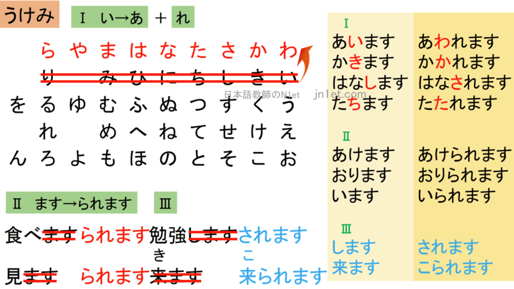
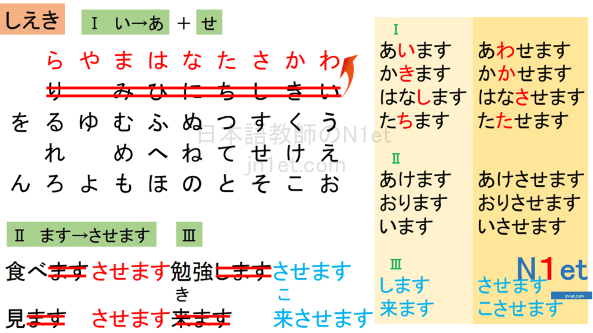
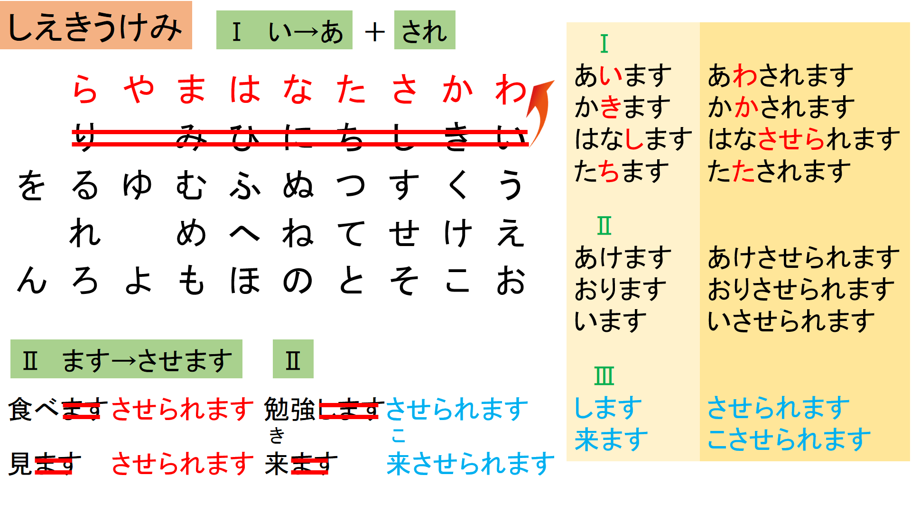

**1、「です·ます」体——用于[口语]文章，以及青少年读物、说明书和书信等。 是口语形式，所以给人一种亲切感。**

但是在「です·ます」体的文章中，只是在句末用「です·ます」，句子的中间的连用形中顿或「て」形接续时用简体，句子中间的动词作定语通常也用简体。

日曜日にはデパートへ行き、買い物をして、レストランで食事をしてきました。

です / でした / ではありません / ではありませんでした / でしょう

**2、「だ」体——用于口语文章，但不如「です·ます」体那么恭敬、郑重。
**
だ / だった / ではない / ではなかった / だろう

**3、「である」体——用于写论文，论说文、新闻报道等较生硬的文章。**

である / であった / ではない / ではなかった / であろう

# 文法

### のは

#### V+のは＋形容詞　（の＝こと）意見、感想

一人で子供を育てるのは大変です。
習慣を変えるのは難しいです。
言うのは簡単ですが、やるのは難しいです。

#### V普通、い形、な形＋のは＋名詞です。　強調

山田さんは北海道の小さな町で生まれました。
ー＞山田さんが生まれたのは**北海道の小さな町**です。（のは＝ところ）

李さんは去年日本へ来ました。
ー＞李さんが日本へ来たのは去年です。（のは＝とき）

甘いものならなんでも好きですが、特に好きなのはチョコレートです。）（のは＝もの）

### のが

#### V+のが＋形容詞　（の＝こと）　好み、能力

##### 好きだ、嫌いだ、上手だ、下手だ、速い、遅い

私は音楽を聞くのが好きです。

私は混んでいる電車を乗るのが嫌いです。

### のを

#### V+のを＋忘れました／知っています

鍵をかけるのを忘れました。

薬を飲むのを忘れました。

財布を持ってくるのを忘れました。

部長に連絡するのを忘れました。

李さんが結婚するのを知っていますか。（いいえ、知りませんでした）
駅前に大きなスーパーができたのを知っていますか。

### のに

#### けれども　普通形＋のに

昨日１０時間も寝たのに、まだ眠い。

#### 用途、目的　V＋のに、N＋に

これはなにをするのに使う？　巻き寿司を作るのに使うよ。

この辞書は、日本語の勉強に使う。

#### 時間、経費　V＋のに

宅急便で荷物を送るのに、９００円かかった。

車で行くのに、１時間は必要だ。

#### 評価　V＋のに、N＋に

ピーラーは皮を剥くのに便利だ。

この辞書は日本語の勉強に役に立つ。　

### 〜には

#### ①動作の目的

　前項には目的を、後項（こうこう）にはその目的を達成するために必要な条件を述べます。

新しい生活に慣れる**には**時間が必要。

彼女は恋をする**には**まだ若すぎる。

#### ②評価の基準

　人名を表す名詞について、その人物にとってのある状況に対する評価を表します。
　後件には主に難度に関する語がきます。

この仕事は新人**には**できない。

これは難しいから子ども**には**分からない。

### N＋ときたら

##### ある人物や物事を取り上げ、それについての話し手の非難や不満を表す。後件を省略した形もよく使われる。==**後件を省略して、文末で使われることも多いです**。==

うちの旦那**ときたら**、子供の世話もしないで一日中テレビを見ている。

最近のYoutuber**ときたら**、非常識な人が多すぎる。

うちの犬**ときたら**、一度散歩に出ると、全く家に帰ろうとしない。

私の彼氏**ときたら**、一緒にいてもいつもスマホばかりいじっている。

母**ときたら**、友達と電話を始めると、一時間は終わらない。

最近のドラマ**ときたら**、どれも同じような展開ばかりでつまらない。

週刊誌の記事**ときたら**、嘘ばかりだ。

長女は成績も優秀でとてもしっかりしているのに、うちの次女***\*ときたら\****。

我々が若かった頃は汗水流して朝から晩まで働いていたにも関わらず、最近の若者***\*ときたら\****。

>**「～と来た日には」**という同じ意味の少し古い表現もあります。
>
>うちの息子**と来た日には**、毎日遊んでばかりで全く勉強をしようとしない。
>あいつ**と来た日には**、約束の時間に待ち合わせ場所に来たことがない。

### ~だけに／~だけあって

#### だけに

##### 1️⃣相応　正是因为……　

日本での生活が長かった**だけに**、彼はとても日本語が流暢だ。

この製品は安い**だけに**、すぐ壊れる。

夏休み**だけに**、観光地はどこも人でいっぱいだ。

># 「あけあって」と置き換え可能
>
>彼はまだ若いだけに、記憶力が優れている。
>彼はまだ若い**だけあって**、記憶力が優れている。
>
>## 手への皮肉を込めた言い方として使われる場合もあります。
>
>料理教室に通っている**だけあって**、色々な料理が作れるんですね。
>
>#### だけのことはる
>
>彼はほんとに英語が上手ですね。さすがアメリカに10年も住んでいた**だけのことはある**。
>
>

##### 2️⃣尚更　更加（越发）……

最近は暑い日が続いているが、今日は風がない**だけに**、なおさら暑く感じる。

今まで苦労して練習してきた**だけに**、今回の勝利はなおさら嬉しいでしょうね。

生活が貧乏[びんぼう]な/貧乏であるだけに、なおさら勤勉[きんべん]に働くべきである。

##### 3️⃣反予想　正是因为……反倒……

自分の家族だけに、かえってたいへん失礼なことを言ってしまうことがある。

彼は普段から大人しい性格な**だけに**、かえって怒らせたらとても怖いだろう。

親友は私のことなら何でも知っている**だけに**、かえって何も隠し事ができないので困ることもある。

今回の試験はいつもと比べて非常に簡単だった**だけに**、かえって油断して失敗した人が多かった。

### 〜だろう

### 〜だろうか

###### ==反語==

こんな話、誰が信じてくれる**だろうか**…
→誰かが信じてくれるだろうか？**いや、たぶん信じてくれる人はいないだろう**

#### ~からには/以上は

###### 強い気持ちを表す

・せっかく来たからには色々な所に行きたいですよね。

・目標を決めてるからにはなんとか達成したい。

・仕事である以上嫌なことをがあるのは当たり前です。

#### 〜からすると

〜からすると／すれば／して

大人から見れば、子供の失敗は小さなことだ。

#### 〜にしても/〜としても

### 

# 接続詞

前の事がらから、当然、類推される結果とは逆の結果があとに続く。

#### 〜ものの/~とはいうものの

一生懸命に勉強したものの、大学に受からなかった。

ハワイは楽しいものの、旅行代はものすごく高い。

この辺の環境は静かなもの、道が暗くて怖いです。

彼はまだ子供であるものの、考え方はすごく大人っぽいです。

#### ~とはいえ/〜とはいっても

#### /しかし/けど/が

#### 〜にしては

###### 〜から予想することとは違う

初めてやったにしては、うまいね。

10年も英語を勉強したの？！..それにしては下手だね。

#### 〜わりに／〜なのに

値段のわりに、まずいね。

美人なわりに、モテないね。

#### 〜といっても

英語が話せるといっても、あいさつだけだよ。

#### もってのほか

「もってのほか」とは、何かを絶対に受け入れられない、受け入れがたいという意味の日本語の表現です。以下のように使われることがあります。

1. そのような行為はもってのほかだ。 (Such behavior is intolerable.)

# 表現

#### 耳をそば立てる

##### 意味: 注意深く聞き耳を立てることや、情報を集めるために注意して聞くことを表します。

1. 彼は周囲の会話を耳をそばだてて聞いていた。

2. インタビュアーは相手の言葉に耳をそばだてて注意深く聞いていた。

   

#### 目の当たりにする

この表現は、何か重要な出来事や驚くべき光景を自分の目で確認する状況を表現する際に使われます。

1. 彼の驚くべきパフォーマンスを目の当たりにしたとき、私は本当に感動しました。

2. 彼女が事故に遭った現場を目の当たりにしたとき、私はとても心配しました。

3. ニュースで地震の被害を目の当たりにしたとき、驚きと悲しみが込み上げてきました。

   

#### ご機嫌を取る

月曜日からピザを頼むなどして自分のご機嫌をとりますね！

#### おせるくらい

1. ##### 「自分でできるくらい簡単だ」何かを簡単にできるほど、その作業やタスクが容易であることを表現します。 

   例: この問題はおせるぐらい簡単だよ。 (This problem is easy enough for you to solve.)

   

2. ##### 「十分に経験や能力がある」という意味：ある特定のことについて、自分には十分な経験や能力があることを表現します。 

   例: 彼はそのプレゼンテーションをおせるぐらい経験がある。 (He has enough experience to handle that presentation.)

#### 火の粉

1. 彼の情熱的なスピーチは会場中に火の粉を散らしました。
2. 彼女の演技には情熱がこもっていて、観客に火の粉を与えました。
3. その事件は社会に大きな火の粉を降りかけました。

「火の粉」は、その活動や言動が周囲に大きな影響を与えることを表現する際に使われます。熱気や情熱が広がり、その結果として周囲に感動や興奮が広がる様子をイメージさせます。

# 単語１

#### 頼み込む

##### 意味: 相手に対して頼みごとを繰り返したり、しつこく頼んだりすることを表します。

1. 彼は友人に頼み込んでお金を貸してもらおうとした。

2. 子供が親におもちゃを買ってもらうために頼み込んでいる。

3. 面接の結果を知りたくて、彼は会社に頼み込んだ。

   

#### 喘ぐ（あえぐ）

意味: 息を切らしたり苦しそうに息をすることを表します。

1. 彼は長い階段を上る間、喘いでいました。
2. 暑さで喘ぎながら、彼は水を飲みました。
3. 運動の後、彼女は喘ぎながら深呼吸をしました。

#### 支度（したく）

意味: 出かける前や特定の活動を行う前に必要な準備や手続きをすることを指します。

1. 旅行に行く前に支度を整える必要があります。

2. 朝の出勤前に支度を整えて、準備万端で出かけました。

3. パーティーのために料理の支度をすることになりました。

   

#### 紛らす（まぎらす）

意味: 心や注意を他のことに向けさせて、気晴らしをすることや、問題や悩みを一時的に忘れさせることを指します。

1. 仕事のストレスを紛らすために、趣味に没頭することが大切です。

2. 彼女は悲しみを紛らすために友達と外出することにしました。

3. 緊張を紛らすために、深呼吸をすることが効果的です。

   

#### 伝い落ちる／滑り落ちる

意味: 上から下に向かって滑り落ちる、または傾斜や表面に沿って移動することを指します。

1. 雨が傘の上を伝い落ちて地面に滴り落ちた。
2. 子供が滑り台を伝い落ちて楽しそうに笑っている。
3. リンゴが斜面を伝い落ちて川に入った。
4. 

#### 似通う（にかよう）

1. 彼らの考え方は非常に似通っていて、ほとんど同じ価値観を持っています。

2. 兄弟姉妹は容姿が似通っており、よく兄弟と間違えられます。

3. この二つの映画はテーマが似通っており、同じようなメッセージを伝えています。

4. 彼らの発音は非常に似通っていて、同じ地域出身だと思います。

5. グループのメンバーは意見が似通っており、円滑なコミュニケーションができます。

   

#### 見放す　みはなす

1. 彼女は彼を見放して、別の人と付き合い始めた。
2. 彼は昔の趣味を見放して、新しい趣味を見つけた。
3. 会社はその製品を見放し、新しい製品の開発に注力することになった。
4. 彼は友人を見放し、彼らとの交流を絶った。
5. 見放された犬は悲しそうな目で人々を見つめていた。

「見放す」は、人間関係や興味・関心の対象などさまざまな場面で使用される言葉です。注意して使用し、相手の感情や状況を考慮するようにしましょう。

#### とかく

**１** さまざまな物事を漠然とさす。何や彼 (か) や。いろいろ。

「とかくするうちに一年が過ぎた」

**２** ある状態になりやすいさま。または、ある傾向が強いさま。ともすれば。ややもすると。

「年をとるととかく忘れっぽくなって困る」

#### ぶちまける blurt out

「ぶちまける」は日本語の俗語であり、強い感情や行動を表現するために使用されます。一般的には、「ぶちまける」は何かを力強く投げつけたり、衝撃的に放出したりすることを意味します。具体的な意味や用法については、文脈によって異なる場合があります。

以下に「ぶちまける」の一般的な用法といくつかの例文を示します：

1. ##### 感情をぶちまける（发泄情绪）

   彼は怒りをぶちまけて罵声を浴びせた。

   悲しみをぶちまけることで心の重荷を軽くすることができる。

2. ##### 言葉をぶちまける（倾吐言辞）

   彼は真実をぶちまけて、みんなを驚かせた。

   嘘をぶちまけて信用を失った。

3. ##### ものをぶちまける

   彼は怒りのあまり机の上の物をぶちまけた。

   ゴミ箱にゴミをぶちまけてしまった。

   

# 単語２

### 限る

#### に限る

​		夏はビールに限るな！
​		飲み会の後にとんこつラーメンに限るね！

#### に限り　　（だけ。ちょっと硬い言い方）

​		始めてのお客様に限り、３０％オフです。
​		先着100名様に限り、予約を受け付けます。

#### 〜限り　　（〜をする間）

​		日本にいる限り
​		諦めない限り、絶対合格できます。

#### 〜に限らず　（だけではなく）

​		彼は平日に限らず、仕事をしている。
​		冬に限らず、風邪を気をつけなければなりません。

#### 〜に限って　（こそ〜の時に運悪く）

​		詐欺師に限って、いい人そうに見える。
​		急いでる時に限って、よく信号に引っかかる。
​		帰ろうとした時に限って、雨が降る。

#### 〜に限って〜ない　（〜は絶対にない)

​		あのレストランに限って、客にまずに料理を出すはずがない。

# 単語３

過去 かこ

加工　かこう

格好　かっこう

# 擬態語

#### 見る

##### きょろきょろ

東京に始めて来た時、きょろきょろしていたら変な人だと思われた。

##### じっと

話したこともないのにじっと見てくる男の子がいます。私のことが好きなのかしら。
じっと考える

##### じろじろ

何さっきからじろじろ見ているの？本当に失礼ね

##### ちらちら

おい！ちらちらどこを見ているんだ！まだ授業は終わってないぞ。

#### 感じる

##### さらさら

美容室帰りのサラサラ髪。

##### ツルツル

温泉に入ると肌がツルツルになりますよね！
雪が降った次の日は道路がツルツルだから運転に気を付けないと。

##### すべすべ

赤ちゃんの肌って本当すべすべだよね。

##### ふわふわ

干したばかりの布団はふわふわしていてとても気持ちいい。

##### ザラザラ

もう夏になるし、かかとのサラザラをなくしたい。

##### カサカサ

# 敬語

## 一覧表

| **本形**         | **尊敬語**                                       | **謙譲語**                                                   | **丁寧語**                                                   |
| ---------------- | ------------------------------------------------ | :----------------------------------------------------------- | ------------------------------------------------------------ |
| **使用方法**     | 目上の人に使う。相手を立てるときに使う。         | 自分をへりくだるときに使う。自分がへりくだることで、相手を立てる。 | 聞き手に対して丁寧に述べる言葉。 「です」「ます」「ございます」を付けて使う。相手・内容を問わない。 |
| **行為をする人** | 相手                                             | 自分                                                         | 問わない                                                     |
| する             | なさる、される                                   | いたす:自分が一方的に行う行為  させていただく:相手からの許可や好意により恩恵を受ける行為の場合 | します                                                       |
| 言う             | おっしゃる、言われる                             | 申す、申し上げる                                             | 言います                                                     |
| 行く             | いらっしゃる、おいでになる                       | うかがう、参る                                               | 行きます                                                     |
| 来る             | いらっしゃる、おいでになる、見える、お越しになる | 参る、伺う                                                   | 来ます                                                       |
| 知る             | お知りになる、ご存じだ                           | 存じる、存じ上げる、承知する                                 | 知っています                                                 |
| 食べる           | 召し上がる、おあがりになる                       | いただく、頂戴する                                           | 食べます                                                     |
| いる             | いらっしゃる、おいでになる                       | おる                                                         | います                                                       |
| 見る             | ご覧になる                                       | 拝見する                                                     | 見ます                                                       |
| 聞く             | お聞きになる                                     | 拝聴する、うかがう                                           | 聞きます                                                     |
| 座る             | お掛けになる                                     | お座りする、座らせていただく                                 | 座ります                                                     |
| 会う             | お会いになる、会われる                           | お目にかかる                                                 | 会います                                                     |
| 伝える           | お伝えになる                                     | 申し伝える                                                   | 伝えます                                                     |
| わかる           | おわかりになる、ご理解いただく                   | かしこまる、承知する                                         | わかりました                                                 |
| 読む             | お読みになる                                     | 拝読する                                                     | 読みます                                                     |
| 与える           | くださる、お与えになる                           | 差し上げる                                                   | あげます                                                     |
| 受け取る         | お受け取りになる                                 | 賜る、頂戴する、拝受する                                     | 受けとります                                                 |
| 利用する         | ご利用になる                                     | 利用させていただく                                           | 利用します                                                   |
| 思う             | お思いになる、おぼし召す                         | 存じる、拝察する                                             | 思います                                                     |
| 買う             | お買いになる、お求めになる                       | 買わせていただく                                             | 買います                                                     |
| 考える           | お考えになる、ご高察なさる                       | 拝察する、検討いたします                                     | 考えます                                                     |
| 待つ             | お待ちになる、お待ちくださる                     | お待ちする                                                   | 待ちます                                                     |
| 帰る             | お帰りになる、帰られる                           | おいとまする                                                 | 帰ります                                                     |
| 家               | 御宅（おんたく）                                 | 拙宅（せったく）                                             | –                                                            |
| 会社             | 貴社（きしゃ）　御社（おんしゃ）                 | 弊社（へいしゃ）                                             | –                                                            |
| 店               | 貴店（きてん）                                   | 弊店（へいてん）                                             | –                                                            |
| 銀行             | 貴行（きこう）                                   | 弊行（へいこう）                                             | –                                                            |
| 学校             | 貴校（きこう）                                   | 弊校（へいこう）                                             | –                                                            |
| 新聞             | 貴紙（きし）                                     | 弊紙（へいし）・小紙（しょうし）                             | –                                                            |
| 雑誌             | 貴誌（きし）                                     | 弊誌（へいし）・小誌（しょうし）                             | –                                                            |
| 地位             | 貴職（きしょく）                                 | 小職（しょうしょく）                                         | –                                                            |

#### する

##### いたす

ご連絡いたします
お知らせいたします
失礼いたします

##### させていただく

確認させていただきます
書類を処分させていただきます
検討させていただきます
お休みさせていただきます
欠席させていただきます

> 恩恵（おんけい）を受けている
> 相手の許可をもらってから行動に移ること
>
> ❎会社をやめさせていただきます
> ✅会社をやめさせていただけないでしょうか？
>
> ❎ご連絡させていただきます
> ✅ご連絡いたします
> ✅ご連絡申し上げます

#### 案内

##### 案内する

​		ご案内します
​		ご案内いたします
​		ご案内申し上げます

##### 案内している

​		ご案内しております

#### 相手の行為にお礼を言う

​	くれる
​		くださる
​			妹が私にプレゼントをくれました。
​			先生が私に日本語を教えてくださいました。
​	もらう
​		いただく（よく使う）
​			私が妹にプレセントをもらいました。
​			私が先生に日本語を教えていただきました。

| 間違い                                                 | 模範解答                                                     | 解説                                                         |
| :----------------------------------------------------- | :----------------------------------------------------------- | :----------------------------------------------------------- |
| どうぞお召し上がり下さい                               | どうぞ召し上がって下さい                                     | 召し上がるという尊敬語に「お〜になる」をつけたものでなので、二重敬語になる |
| おっしゃられる通りだと思います                         | おっしゃる通りだと思います                                   | おっしゃるだけで尊敬語なので、「られる」をつけると二重敬語になる。同様に、おっしゃられました、ではなく、おっしゃいました、が正しい表現 |
| ご覧になられる                                         | ご覧になる                                                   | ご覧になるだけで尊敬語。尊敬語の「れる・られる」が重なっているため二重敬語 |
| お客様がお越しになられました                           | お客様がお越しになりました                                   | 「お越しに」「なられる」がそれぞれ尊敬語のため、二重敬語     |
| 申されていました                                       | おっしゃっていました                                         | 申されるのうち「申す」は謙譲語で、「れる」尊敬の助動詞のため不適切 |
| ご拝受いただければ幸いです                             | ×　拝見させていただきました ○　拝見しました ×　拝見されましたか　 ○　目を通していただけましたか・ご覧になりましたか | 「拝」という表現自体が、つつしんで、というような意味を持つ謙譲語なので、相手の行為に対して使うのは間違い |
| 一緒に参りましょう                                     | お伴いたします・ご案内いたします                             | 参る」は謙譲語なので、誘った相手も一緒にへりくだる表現となってしまう |
| ○○様が参られています                                   | ○○様がお見えです                                             | 謙譲語の「参る」を相手に使ってしまっているため不適切         |
| （他社の相手に対しての）本日は休みをいただいております | 本日休みを取っております                                     | 「いただく」は自社に対しての敬意の表現                       |
| ○○様でございますね                                     | ○○様でいらっしゃいますね                                     | ございますは丁寧語ではありますが尊敬語ではないので、相手の名前につけてしまうのは間違い |
| あなたが申されたように                                 | あなたがおっしゃいましたように                               | 「申す」は謙譲語のため相手に使うのは不適切                   |
| あの件についてうかがっていますか                       | あの件についてお聞きになりましたか                           | 「うかがう」は謙譲語のため相手に使うのは不適切               |
| 花に水をあげる                                         | 水をやる                                                     | 「あげる」というのは「やる」の謙譲語のため不適切             |
| おられますか？                                         | いらっしゃいますか？                                         | 「おる」は自分がへりくだるときの表現                         |
| どちらにいたしますか？                                 | どちらになさいますか？                                       | 「いたします」が謙譲語のため相手に使うのは不適切             |
| 上司にも申し上げておきます                             | 上司にも申し伝えておきます                                   | 社外の人に対して、自分の上司を持ち上げる表現は使わない       |
| 資料をご持参ください                                   | 資料をお持ちになってください                                 | 「持参」は謙譲語になるので、相手への用法としては使えない     |
| お客様をお連れしました                                 | お客様をご案内いたしました・お見えになりました               | 「お連れしました」ではお客様ではなく、その報告相手に対して敬意を払っていることになる |
| お求めやすい商品です                                   | お求めになりやすい商品です                                   | 求めるの尊敬語は「お求めになる」                             |
| これで結構でしょうか                                   | これでよろしいでしょうか                                     | 「結構」はこちらの問いかけに相手がOKを出すとき、つまり相手がこちらに返す言葉 |
| ご注文の品はお揃いになりましたか                       | ご注文の品は、以上でよろしいでしょうか                       | お揃いが料理に対しての敬語                                   |
|                                                        |                                                              |                                                              |
|                                                        |                                                              |                                                              |
|                                                        |                                                              |                                                              |
|                                                        |                                                              |                                                              |
|                                                        |                                                              |                                                              |
|                                                        |                                                              |                                                              |
|                                                        |                                                              |                                                              |
|                                                        |                                                              |                                                              |
|                                                        |                                                              |                                                              |
|                                                        |                                                              |                                                              |
|                                                        |                                                              |                                                              |
|                                                        |                                                              |                                                              |
|                                                        |                                                              |                                                              |
|                                                        |                                                              |                                                              |
|                                                        |                                                              |                                                              |
|                                                        |                                                              |                                                              |
|                                                        |                                                              |                                                              |
|                                                        |                                                              |                                                              |
|                                                        |                                                              |                                                              |
|                                                        |                                                              |                                                              |
|                                                        |                                                              |                                                              |
|                                                        |                                                              |                                                              |
|                                                        |                                                              |                                                              |

| 失礼な言葉・表現             | 正しい言葉・表現                         | 解説                                                         |
| :--------------------------- | :--------------------------------------- | :----------------------------------------------------------- |
| ご苦労さまです               | お疲れさまです                           | 「ご苦労さま」は目下の人に対して用いる言葉                   |
| 了解しました                 | 承知しました・かしこまりました           | 「了解しました」は敬意のないフランクな表現                   |
| しばらくぶりです             | お久しぶりです・ご無沙汰しておりました   | 「しばらくです」は同僚や目下に対して用いる表現               |
| いつもお世話様です           | いつもお世話になっております             | 「いつもお世話様です」は目上の人に用いるべきではない表現     |
| ご一緒します                 | お供させていただきます                   | 「ご一緒」という言葉は、対等な関係で使われるもの             |
| 大変参考になりました         | 大変勉強になりました                     | 「参考」という言葉が、自分の考えを決める際の足しにするといった表現のため失礼にあたる |
| すいません                   | ありがとうございます・申し訳ございません | 「すいません」は「すみません」の口語として定着したため、目上の人に用いるには失礼な表現 |
| わが社                       | 弊社・当社                               | 外向けに使ってしまうと偉そうな印象を与える                   |
| なるほどですね               | おっしゃるとおりです                     | 「なるほど」自体が目下の人に対して使うもの                   |
| おわかりいただけたでしょうか | ご理解いただけたでしょうか               | わかりましたか、という意味になり、目上の人に使うには失礼な表現 |
| お座りください               | お掛けください                           | 犬のお座りのイメージがあるため失礼な表現にあたる             |
| どうしますか                 | いかがいたしますか                       | 「どうする」という言葉には敬意が含まれていないため           |
| させていただいております     | しております                             | 「させていただきます」「〜いただいております」は、基本的には「自分のすることが相手に良い影響を与えるとき」「相手の許可が必要なとき」にのみ使える表現です。相手が頼んだわけでもない場面での使用は失礼な印象を与えてしまうこともあります |

# 场景

#### 聊天气

##### いいお天気ですね

##### あいにくのお天気で

運動会や旅行など、晴れてほしい日に、雨が降った場合に用いるフレーズ
楽しみにしていたのに、あいにくのお天気で残念ですね。

##### ひと雨来そうですね

これでひと雨で来ると、涼しくなりますよね。

# 動詞変形

|                                                              | **受身**           | **使役**           | **使役受身**           | **使役受身短縮** |
| :----------------------------------------------------------- | ------------------ | ------------------ | ---------------------- | ---------------- |
| ==**第一グループ＝「五段活用動詞」飲む**==                   | **あ段＋れる**     | **あ段＋せる**     | **あ段＋せられる**     | **あ段＋される** |
| 飲む                                                         | 飲まれる           | 飲ませる           | 飲ませられる           | 飲まされる       |
| 働き                                                         | 働かれる           | 働かせる           | 働かせられる           | 働かされる       |
| 書く                                                         | 書かれる           | 書かせる           | 書かせられる           | 書かされる       |
| 話す                                                         | 話される           | 話させる           | 話させられる           | ~~話さされる~~   |
|                                                              |                    |                    |                        |                  |
|                                                              |                    |                    |                        |                  |
| ==**第二グループ＝「一段活用動詞」食べる**==                 | **るー＞られる**   | **るー＞させる**   | **るー＞させられる**   |                  |
| 食べる                                                       | 食べられる         | 食べさせる         | 食べさせられる         |                  |
| いる                                                         | いられる           | いさせる           | いさせられる           |                  |
| ==**第三グループ＝「不規則活用動詞」（「来る」「する」）**== | **するー＞される** | **するー＞させる** | **するー＞させられる** |                  |
| します                                                       | されます           | させます           | させられます           |                  |
| 来ます（き）                                                 | こられます         | こさせます         | こさせられる           |                  |
| ==特別==                                                     |                    |                    |                        |                  |
| 起きる                                                       | 起きされる         | 起きさせる         |                        | 起こされる       |
|                                                              |                    | 起こす（他動詞）   |                        |                  |
| 寝る                                                         |                    | 寝かす（1）        |                        | 寝かされる       |
|                                                              |                    | 寝かせる（II）     |                        | 寝かせられる     |
| 帰る                                                         |                    | 帰らせる           |                        |                  |
|                                                              |                    | 帰す（他動詞）     |                        |                  |
| 泣く                                                         |                    | 泣かせる           |                        |                  |
|                                                              |                    | 泣かす（他動詞）   |                        |                  |
| 着る                                                         |                    | 着せる（II）       |                        | 着せられる       |
| 見る                                                         |                    | 見せる（II）       |                        | 見せられる       |
|                                                              |                    |                    |                        |                  |
|                                                              |                    |                    |                        |                  |
|                                                              |                    |                    |                        |                  |
|                                                              |                    |                    |                        |                  |
|                                                              |                    |                    |                        |                  |
|                                                              |                    |                    |                        |                  |
|                                                              |                    |                    |                        |                  |

## 受身形（被動）

#### **主語は　人に　受身動詞**　（被動）

（わたしは）先生に褒められました。

（わたしは）お母さんに買い物を頼まれました。

（わたしは）兄にパソコンを壊されました。
　

>## 主語として提示されるのは、所有**物**ではなく、この行動に混乱している人（所有**者**）です
>
>❌　わたしのパソコンは、兄に壊されました。
>
>## この受身の文型は、ほとんどの場合、主語がその行動に迷惑を受けていることを意味します。
>
>感謝の気持ちを表す場合は、以下の様な表現がふさわしいです。
>
>❌　わたしは友達にパソコンを修理されました。
>
>🔴 わたしは友達にパソコンを修理してもらいました。

#### 物、事　が／は　受身形（客観視）

##### ある事柄を話す時、主語に特別な注意を払わず、誰がそれを行うかは重要ではない、受身動詞を使って、その事柄をテーマとしてとらえることがあります。

この雑誌は、世界中で売られています。

英語は、世界中で話されています。

># 製造物を言いたい時、原材料は「から」で表され、材料は「で」で表されます。
>
>ビールは、麦から作られます。
>
>・日本の家は、木で作られます。

## 使役形 しえき

#### 主語は　人に　[名詞]を　使役動詞。（他動詞）

お母さんは、赤ちゃんにミルクを飲ませます。

先生は、学生に本を読ませます。

#### 主語は、人を（[名詞]　へ／と／に）使役動詞。（自動詞）

##### 元の文の動詞が自動詞の場合、使役文では動作の主体を「を」で示します。

部長は、田中さん**を**アメリカへ出張させます。

先生は、学生を教室の外に立たせます。

>## 「**日本語は1文に「を」がひとつだけ**」
>
>娘は道の右側を歩いた
>
>ー＞私は娘**に**道の右側を歩かせます。

#### 使役動詞て形 ＋ いただけませんか？／もらえませんか？

##### 相手に自分の行動を許可するように要求する場合の表現です。

明日休ませていただけませんか？

## 使役受身形（使役被動）（短縮形）

##### 用于表达一个人被他人迫使或影响做某事的情况

>省略形→グループ1の変化時「せら」→「さ」に省略することができます。
>但し、「させら」の時は「さ」が重複するので、通常は省略されません。
>
>**省略形：**
>言わせられます→言わされます
>書かせられます→書かされます
>話させられます→　Ｘ
>立たせられます→立たされます
>飲ませられます→飲まされます
>取らせられます→取らされます

#### 主語はＮ（人）に使役受身

##### 主語はＮ（人）の指示に従って行動します。やりたくない事をさせられた被害の感情を表します。

毎日母に野菜を食べさせられます。

# 自動詞・他動詞

#### 始まる・始める

夜が明けると、新しい一日が始まります。

私は新しいプロジェクトを始めました。

#### 終わる・終える

映画が終わると、観客たちは拍手を送りました。

午前五時三十分ーシャワーを終え、出かける**支度**をする。

