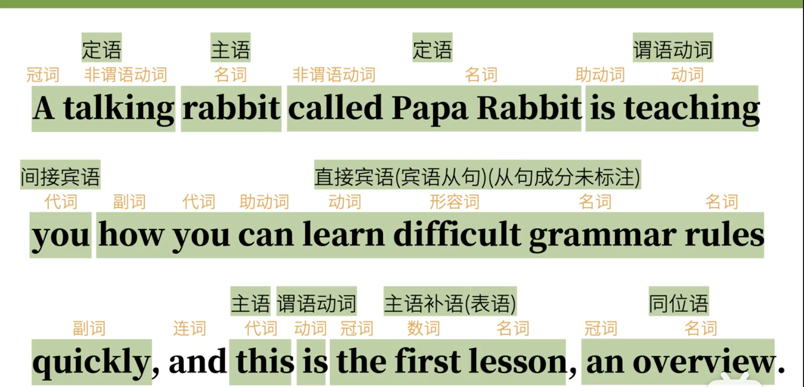
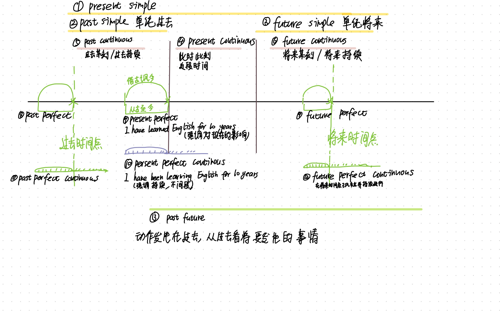

---
 
---

# 语法体系

什么（主语） + 怎么样（谓语-广义动词）

## 基本句型

1.可以独立完成的动作
主语+不及物动词
Papa Rabbit sleeps.

2.有一个动作的承受者
主语+及物动词+宾语 
Papa Rabbit likes you.

3.有两个动作承受着
主语+双及物动词+间接宾语+直接宾语
 Papa Rabbit **teaches** you **English**.

4.只有一个动作承受着（但需补充）
主语+复杂及物动词+宾语+（宾语）补语
Papa Rabbit considers you smart.

5.非“动作“ （把后者信息赋予前者，把后者和前者连系起来）
主语+**<u>系动词</u>**+（主语）补语/表语
Papa Rabbit is tall.

## 词性

### 名词

#### 名词短语 

##### 限定词+修饰词adj+主体词n

限定词在CS/U/专业名词时可省略
修饰词在任何时候都可省略
主体词在笼统明显时可省略

| 限定词               | 修饰词       | 主体词                        |
| -------------------- | ------------ | ----------------------------- |
| a                    | good(可省略) | boy                           |
| 可数复数（CS）可省略 | good         | boys                          |
| 不可数（U）可省略    | good         | news                          |
| 专有名词可省         | 专有名词可省 | China                         |
| The                  | rich         | ~~people~~(笼统明显时可以省)  |
| the                  | best         | ~~student~~(笼统明显时可以省) |

##### 🌟名词性短语在感叹句中的用法

What do you want?
->You want what [what-n]

What color do you want?
->You want what color [what-adj]

How do you come here?
->You how come here [how-adv]

##### 感叹句

##### what (adj)+ 名词短语 + （主谓）

what a good boy(the boy/ he is)
what good boys (they are)
what good news (it is)
what good weather

##### how(adv) +v/adj/adv

how good the boy is
how good the boys are
how fast he runs

 

####  可数/不可数名词

可数：单数，复数（规则/不规则）

不可数：量化(a glass of)、可数化( have a good time)

## 句子成分

### 1.主语

#### 不定式 infinitive (做主语看作单数)

To learn English well is very important (头重脚轻)
->It is very important to learn English well （it做形式主语）

#### 动名词 gerund  (做主语看作单数)

Smoking is bad.

#### 句子  (做主语看作单数)

2.谓语动词

3.宾语

4.宾语补语

5.主语补语（表语）

6.定语 Attributive
 主要用来修饰主语和宾语
 **The little white** rabbit ate a **large** carrot
(The little white是主语rabbit的定语，large是宾语carrot的定语)

7.状语 Adverbial
主要用于修饰谓语动词
The rabbit ate **quickly**.

8.同谓语

==句子成分≠词类==

## 谓语动词的“三大本领” TAM

表示动作时间（时） Tense
现在，过去，将来，过去将来

表示动作状态（态）Aspect
一般，完成，进行，完成进行

表示动作的假设，情感 Mood
虚拟语气等

 ※谓语动词无法独立完成以上本领，需要助动词的帮助 

动词除了充当谓语动词以外，还可以充当（非谓语动词）主语，宾语，宾语补语，主语补语，定语等

## 非谓语动词（不再具有TAM属性）

动词不定式
Rabbits eat carrots.
To eat or not eat?

现在分词
The rabbit is eating.
Eating everying,I survived.
Eating carrots is healthy.

动名词

过去分词

## 动词时态 Verb Tenses

### simple

#### 1) present simple-> I do

1⃣️一般，笼统的动作或状态
I want to buy a car
I like swimming.
I have a dream.
I am a student.

2⃣️一直以来的经常性动作
I get up at 8 o'clock every morning.

>## 
>
>**主将从现**
> I will not go to the park if it rains tomorrow.
>->He said he **would** not go to the park if it **rained** <u>the next day</u>间接引语
>
>**客观真理，科学事实**
>The sun rises from the ease
>
>**按时刻表进行**
>The train leaves at eight tomorrow morning
>
>**祈使句天然表将来**
>Open the door,please.
>
>**be to do/be about to do 一般表将来**
>I am to meet her.
>I am about to meet her.

#### 2) past simple-> I did

1⃣️过去的一般，笼统的动作或状态
I wanted to buy a car last month.
I liked swimming when I was young.
I had a dream when I was eight.
I was a studuent.

> past simple:过去发生和现在没有关系
> I lived in Shanghai (我过去住在上海，现在已经搬走了)
>
> present perfect:过去发生某事，与现在有关联
>  I have lived in Shanghai（我可能还住在上海，也可能刚刚搬走。要根据上下文）

2⃣️过去经常性的动作
I played football every week last year.

#### 3) future simple-> I will do

1⃣️将来的一般，笼统的动作或状态
I will buy a car in 2020.
I will swim for 2 hours this afternoon.
I will be a student soon.
You can call me this evening. I'll be at home. 

> # be going to(gonna) 表示计划好的行程（will是当下的决定，不一定有详细的计划)

2⃣️将来经常性的动作(很少用，立flag的感觉)
 It will rain a lot next month.

>## 　　表将来的可能性的高低（低->高）
>
>情态+do
>
>be doing（be going to)
>已经有了一点计划
>I'm metting her this afternoon.
>
>be to do/be about to do  正式计划好，正式下了决定
>
>
>Do/Does 

### Continuous

#### present continuous->I am doing

1⃣️此时此刻正在发生的动作
Please be quiet.I'm working.

2⃣️近段时间持续在发生的动作
My friends is dying （我的朋友快死了）

3⃣️近段时间渐变的动作

4⃣️表一般将来（计划好的事情强烈的意图，不一定要有详尽的安排）
I'm leaving home（我要离家出走）
I'm flying to Tokyo next Monday. 

5⃣️刚刚结束的动作
You don't belive me? I'm telling you the truth. 
Is that a joke? Tell me you're joking

6⃣️表示强烈的主观色彩
He **always complains** about everything.
he **is always complaining** about everything. -更加形象，总是抱怨

#### past continuous-> I was doing

1⃣️过去某个时间点正在发生的动作

2⃣️过去一段时间持续发生的动作

3⃣️表过去将来
He was going abroad when I met him.

I waved to Harry.But he wasn't  looking.

I was showering when somebody rang the door bell

#一种委婉的语气

 I was wondering if you'd like to come out with me.

#### future continuous->I will be doing

This time next week I'll be lying on the beach.   

### perfect

#### present perfect->I have done

>#     怎么理解现在完成时？
>
>for,since,already,yet, before,recently
>
>==1⃣️借古讽今==
>过去式：He opened the door
>一般现在：The door is open
> 现在完成： He has opened the door.
>=>它其实表达了两层意思。他过去开了门，和门现在是开的状态。强调的是门现在是开的。
>用过去结束的动作表示对现在的影响。
>
> I saw the movie ->我看过这部电影
>I have seen the movie->我看过这部电影，所以现在我不想和你去看。或者我想换部电影看
>
>==2⃣️从古至今== 延续性的动词
>I have learned English for 10 years(since 10 years ago)
>Have you been to France.

#### past perfect->I had done

When we got home last night,we found that somebody had broken into the apartment.

※一定要有过去时间标志

>I have seen the movie 
>I had seen the movie **when he invited me.**
>I will have seen the movie when he arrives in Beijing 当他到北京的时候我已经看完电影了（他的飞机是8点，我订的电影票是2点，所以他到的时候我应该已经看完电影了）
>
>I have learned English for 10 years.
>I had learned English for 10 years when I ==graduated==.
>I will have learned English for 10 years when I ==graduate==(主将从现，从句用现在时表将来。当我毕业的时候我已经学了10年英语)

#### future perfect->I will have done

By the time you get home I will have cleaned the house. 

### perfect continuous

#### present perfect continuous->I have been doing

>==现在完成时从古至今的延续==。但强调的是一种不间断性，可持续性。
>
>I have lived in SH for 10 years. 我住在成都10年了，之后怎么也样不知道。可能想搬走，可能想一直住下去。
>
>I have been living in SH for 10 years.  强调的是一直住在成都，以后也会住下去

##### 刚结束的事情(多了一层一直重复的概念)

where have you been? I have been looking for you.

 Tony is working.He's been working all day.

present continuous:You don't belive me? I'm telling you the truth.

#### past perfect continuous->I had been doing

##### 过去的某个时点正在做某个事情

My hands were dirty, because I had been repairing my bike.

#### future perfect continuous->will have been doing

Next year I will have been woriking in the company for 10 years.

### past future 

#### 1)simple past future->would do

从过去看将来
She said she would telephone me when she got there

#### 2)past future continuous->would be doing

在过去的时间点说将来的某一时间点正在进行的动作

#### 3)past future perfect continuous->would have been doing

​    在过去的时间说将来某一时间已经完成或还持续进行的动作

Wanjj@131

### 习题

Planing so far ahead

## 6.代词

###  人称代词

| 主格S | 宾格O/P | 形物代adj+n | 名物代 | 反身代      |
| ----- | ------- | ----------- | ------ | ----------- |
| I     | me      | my          | mine   | myselef     |
| you   | you     | your        | yours  | yourself    |
| he    | him     | his         | his    | himself     |
| she   | her     | her         | hers   | herself     |
| it    | it      | its         | its    | itself      |
| we    | us      | our         | ours   | ourselves   |
| you   | you     | your        | yours  | yourselves  |
| they  | them    | their       | theirs | themseleves |

I hate him(宾格作宾语)
It is me(宾格作表语)

形物代+n=名物代
This is my book = this book is mine

反身代先得有该人称
I love her.
I love myself.
I love herself ❌　

# Mood

## indicative mood

## imperative mood

## Subjunctive Mood

|            |                                                              |                                                     |
| ---------- | :----------------------------------------------------------- | :-------------------------------------------------- |
| 与现在相反 | If I am you, if I have time                                  | if I were you,I might choose this if I had time |
|            |                                                         |                                                     |
| 与过去相反 | if you followed my advice                                    | if you had followed my advice                       |
| 与将来相反 | 保持主将从现原则 if to snows tomorrow if it is to snow tomorrow if it shall snow tomorrow |                                                     |

### if引导的条件句

shall->should
will->would
can->could
may->might

#### 虚拟过去

从句：had done
主句：would/could/might/should + have done

if you followed my adivise,you could make great progress
->if you **had followed** my adivise,you **could have made** great progress

if he had watched this book, he could have understood it.

#### 与现在相反

条件句：were/did
主句：would/could/might/should + do

If I knew it,I would tell you.

if I am you,I will give this video a  a thumbs-up
->if I **were** you,I **would** give this video a thumbs-up(be-were)

#### 与将来相反（将来不可能，或者可能性很小的事件）

条件句：should（were to) +v原形 (should是shall的过去式、此处不表示应该的意思)
主句：would/could/might + do

if I should meet thee after long years,how should I greet thee?

### 一些动词后需要用到虚拟语气 should+do

recommend,suggest, advise, require, request

#### as if/wish/if only 

##### + had done

were/did

would/could/might/should + do

